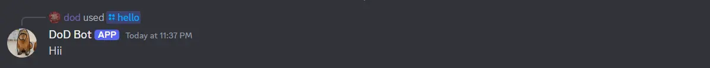
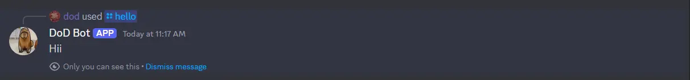
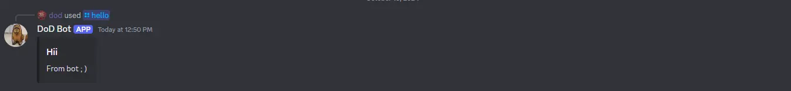
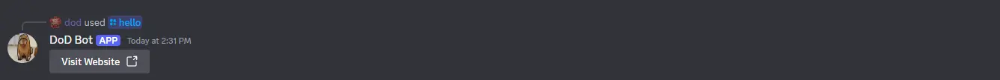

# Context

`Context` is the callback parameter which a handler function takes. You can use `Context` to send interaction responses. With discog you're not just bounded to use context to send interaction responses , you can use `discordgo` at any point to send interactions which fits your need. (**Since discog is still in it's evolving phase you may have to use `discordgo` to interact**) .

## Sending text responses

To send text response you can simply set the content for the response and call the `Send` method.

```go
ctx.SetContent("Hii")
err  := ctx.Send()
```

Result : 



### Adding Flags

You can also add flags to the response by `FlagReply` function.

```go
ctx.FlagReply(discordgo.MessageFlagsSuppressNotifications)
ctx.SetContent("Hii")
err := ctx.Send()
```
To send ephemeral responses you can simply call `FlagEphemeral` function. For example :

```go
ctx.FlagEphemeral()
ctx.SetContent("Hii")
err := ctx.Send()
```

Result :




## Sending component based response

You can easily create a component response like `Message Components` , `Message Embeds` & `Action Rows` using Discog.

### Sending Message Embeds

You can use `SetMessageEmbeds` function to add message embeds. Example :

```go
messageEmbed := discog.NewMessageEmbed() // See MessageEmbed section for creating embeds.

// It's an example you have to define the embed info before sending.
ctx.SetMessageEmbeds([]*discordgo.MessageEmbed{messageEmbed.GetComponent()})

err := ctx.Send()
```

Discog provides a `MessageEmbed` struct to create message embeds. See [Message Embed](/docs/advanced-features/message-embeds).

Result :



### Sending Message Components

You can send action rows, text inputs & components using `SetComponents` function provided by `discog` .

```go
actionRow := discog.NewActionRow()

button := discog.NewButton()

button.SetLabel("Visit Website")
button.SetURL("https://github.com/kisshan13/discog")
button.SetStyle(discordgo.LinkButton)

actionRow.AddComponent(button)

ctx.SetComponents([]discog.Component{actionRow})

err := ctx.Send()
```

Discog provides a `NewActionRow` to create message components. It also have functions to build Text Input, Select Menus & Modals. See [Message Components](/docs/advanced-features/message-components).

Result :



